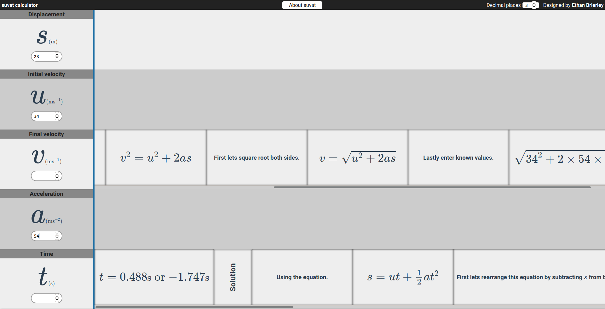

# SUVAT.app

[https://suvat.app/](https://suvat.app/)

## Help

If you run into any issues with this web app please [open an issue](https://github.com/eopb/SUVAT.app/issues/new/choose).

## What is it?

A web app that solves physics problems with constant acceleration.

SUVAT.app also explains the concepts around suvat such as [how the suvat equations are derived](https://suvat.app/about.html#deriving).

## Why make this when there are existing online suvat calculators?

This suvat calculator has not only a better design than the others I have seen. It also provides step by step solutions explaining exactly how you could solve the same problem without the calculator.
